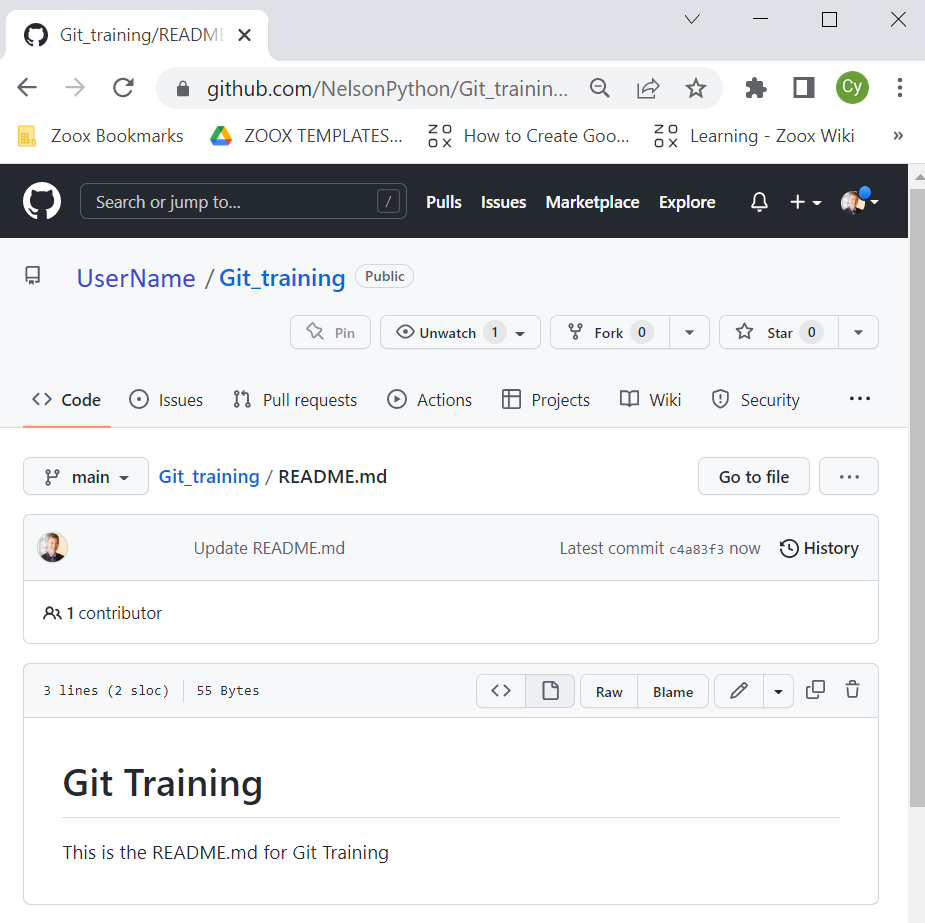
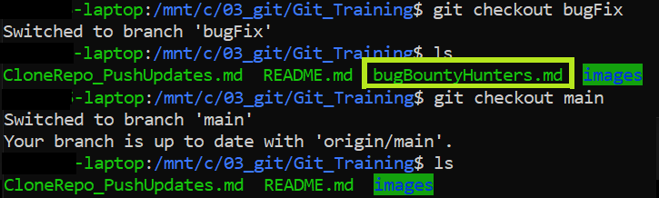
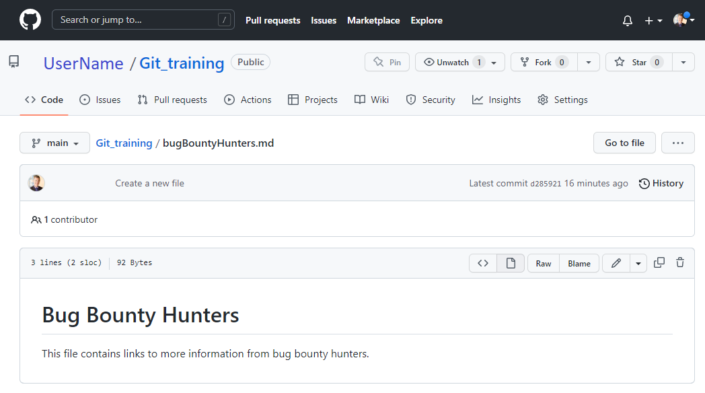

# Exercise: Clone a Github repo and push updated content

Get started by cloning a Github repo, adding content, and pushing updates back to Github.

## Prerequisites: 

1. Set up your test_md repo on Github with a README.md file
2. Create a PAT (personal access token)
3. Install git on Linux.  This example runs on Ubuntu 20.04 LTS installed on Microsoft Windows Subsystem for Linux on Windows 10.

## Github repo

The original repo has only one file, README.md.   Using git on your local machine, follow these steps to clone a repo, add a local file, merge the local file into the main branch, and push the updates back to Github.



## Configure git on local machine
If git is not configured, then configure git.

```
$ git config --global user.name UserName
$ git config --global user.email UserName@email.com
$ git config --global core.editor nano$ git config --list
user.name=UserName
user.email=UserName@email.com
core.editor=nano
```
For more information see:  https://linuxhint.com/install-use-git-linux/

## Clone the repo

Download a copy of the repo

```
$ git clone https://github.com/UserName/Git_Training

Cloning into 'Git_Training'...
remote: Enumerating objects: 29, done.
remote: Counting objects: 100% (29/29), done.
remote: Compressing objects: 100% (24/24), done.
remote: Total 29 (delta 6), reused 0 (delta 0), pack-reused 0
Unpacking objects: 100% (29/29), 31.02 KiB | 49.00 KiB/s, done.
```

## Navigate to the repo folder

``` 
cd Git_Training
```

View the git log


## Check the status

```
$ git status

On branch main
Your branch is up to date with 'origin/main'.

nothing to commit, working tree clean
```

## Add a new file

```
$ git checkout bugFix
$ nano bugBountyHunters.md
```

```
$ git commit -a -m 'Create a new file'

On branch main
Your branch is up to date with 'origin/main'.

Untracked files:
  (use "git add <file>..." to include in what will be committed)
        bugFix.md

nothing added to commit but untracked files present (use "git add" to track)

$ git add bugBountyHunters.md

$ git commit -a -m 'Create a new file'
[main f6cf151] Create a new file
 1 file changed, 3 insertions(+)
 create mode 100644 bugFix.md
```

## Return to the main branch

```
  $ git checkout main

Switched to branch 'main'
Your branch is up to date with 'origin/main'.
```




## Merge the changes from the hotfix branch

```  
$ git merge bugFix
  
Updating 4b58142..d9912f7
Fast-forward
index.html | 7 +++++++
1 file changed, 7 insertions(+)
create mode 100644 index.html
```

## Push the changes back to Github.

  Use your PAT (personal access token) instead of your Github password.

```
$ git remote add hotfix https://github.com/UserName/test_md

$ git push -f hotfix main

Username for 'https://github.com': UserName
Password for 'https://UserName@github.com':
Enumerating objects: 4, done.
Counting objects: 100% (4/4), done.
Delta compression using up to 8 threads
Compressing objects: 100% (3/3), done.
Writing objects: 100% (3/3), 343 bytes | 5.00 KiB/s, done.
Total 3 (delta 0), reused 0 (delta 0)
To https://github.com/UserName/test_md
4b58142..d9912f7 main -> main
```




