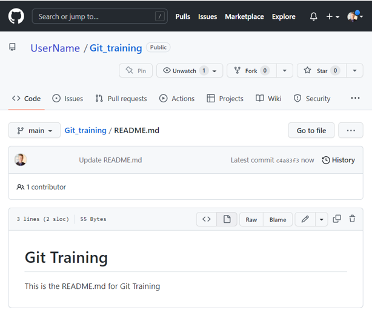
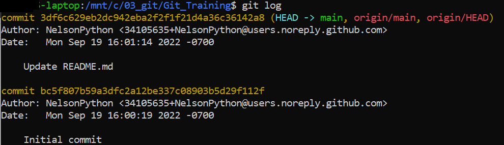
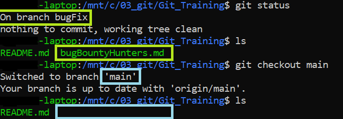
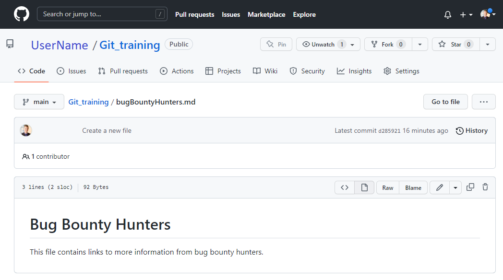

# Exercise: Clone a Github repo and push updated content

Get started by cloning a Github repo, adding content, and pushing updates back to Github.

## Prerequisites: 

1. Set up a repo on Github with a README.md file
2. Create a PAT (personal access token)
3. Install git on Linux.  This example runs on Ubuntu 20.04 LTS installed on Microsoft Windows Subsystem for Linux on Windows 10.

## Github repo



Using git on your local machine, follow these steps to clone a repo, add a local file, merge the local file into the main branch, and push the updates back to Github.

## Configure git on local machine
If git is not configured, then configure git.

```
$ git config --global user.name UserName
$ git config --global user.email UserName@email.com
$ git config --global core.editor nano$ git config --list
user.name=UserName
user.email=UserName@email.com
core.editor=nano
```
For more information see:  https://linuxhint.com/install-use-git-linux/

## Clone the repo

Download a copy of the repo

```
$ git clone https://github.com/UserName/Git_Training

Cloning into 'Git_Training'...
remote: Enumerating objects: 6, done.
remote: Counting objects: 100% (6/6), done.
remote: Compressing objects: 100% (2/2), done.
remote: Total 6 (delta 0), reused 0 (delta 0), pack-reused 0
Unpacking objects: 100% (6/6), 1.22 KiB | 2.00 KiB/s, done.
```

## Navigate to the repo folder

``` 
cd Git_Training
```

View the git log

```
$ git log
```




## Check the status

```
$ git status

On branch main
Your branch is up to date with 'origin/main'.

nothing to commit, working tree clean
```

## Create a new branch

```
$ git checkout -b bugFix

Switched to a new branch 'bugFix'
```

## Add a new file

```
$ nano bugBountyHunters.md
$ git commit -a -m 'Create a new file'

On branch main
Your branch is up to date with 'origin/main'.

Untracked files:
  (use "git add <file>..." to include in what will be committed)
        bugFix.md

nothing added to commit but untracked files present (use "git add" to track)

$ git add bugBountyHunters.md

$ git commit -a -m 'Create a new file'

[bugFix fd209ac] Create a new file
 1 file changed, 3 insertions(+)
 create mode 100644 bugBountyHunters.md
```

## Return to the main branch

```
  $ git checkout main

Switched to branch 'main'
Your branch is up to date with 'origin/main'.
```




## Merge the changes from the bugFix branch

```  
$ git merge bugFix
  
Updating 3df6c62..fd209ac
Fast-forward
 bugBountyHunters.md | 3 +++
 1 file changed, 3 insertions(+)
 create mode 100644 bugBountyHunters.md
```

## Push the changes back to Github.

  Use your PAT (personal access token) instead of your Github password.

```
$ git remote add bugFix https://github.com/UserName/Git_Training

$ git push -f bugFix main

Username for 'https://github.com': UserName
Password for 'https://UserName@github.com':
Enumerating objects: 4, done.
Counting objects: 100% (4/4), done.
Delta compression using up to 8 threads
Compressing objects: 100% (3/3), done.
Writing objects: 100% (3/3), 366 bytes | 6.00 KiB/s, done.
Total 3 (delta 0), reused 0 (delta 0)
To https://github.com/UserName/Git_Training
   3df6c62..fd209ac  main -> main```




