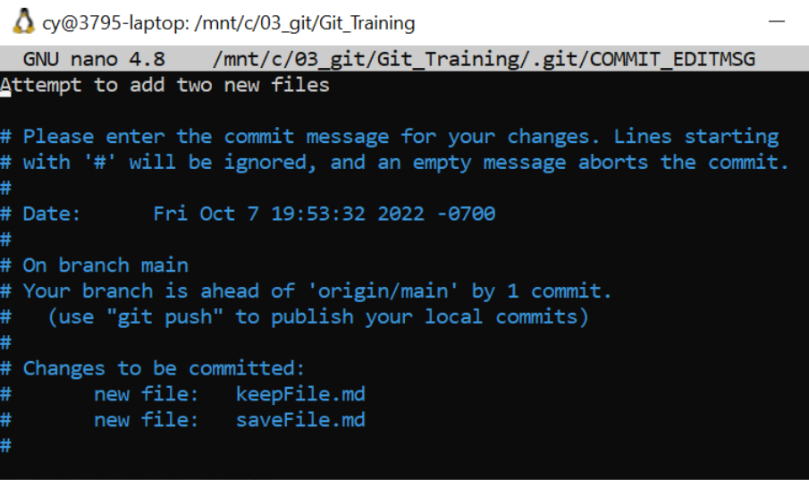
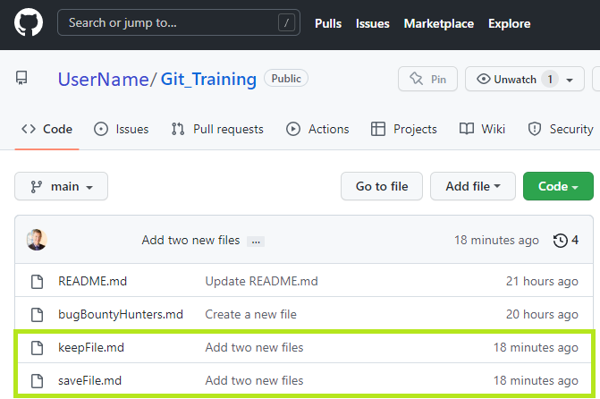

# Amending git commits

Suppose you committed too early and forgot to include some files.  Perhaps a commit has an unexpected outcome.  Commit again using the ` --amend ` option.

### Create two files

```
$ nano keepFile.md
$ nano saveFile.md
```

Git status.  Both of these files are untracked.

```
$ git status
On branch main
Your branch is ahead of 'origin/main' by 1 commit.
  (use "git push" to publish your local commits)
 
Untracked files:
  (use "git add <file>..." to include in what will be committed)
        keepFile.md
        saveFile.md
 
nothing added to commit but untracked files present (use "git add" to track)
```

Add ` keepFile.md `

```
$ git add keepFile.md
$ git status
On branch main
Your branch is ahead of 'origin/main' by 1 commit.
  (use "git push" to publish your local commits)
 
Changes to be committed:
  (use "git restore --staged <file>..." to unstage)
        new file:   keepFile.md
 
Untracked files:
  (use "git add <file>..." to include in what will be committed)
        saveFile.md
```

Go ahead and commit.  Do not use the -a switch.  Git attempts to add both new files, but ` saveFile.md ` is not being tracked.

```
$ git commit -m 'Attempt to add two new files'
[main 5381efe] Attempt to add two new files
 1 file changed, 3 insertions(+)
 create mode 100644 keepFile.md
 ```

Because ` saveFile.md ` was not staged, it was not committed.   Add  ` saveFile.md `

```
$ git status
On branch main
Your branch is ahead of 'origin/main' by 2 commits.
  (use "git push" to publish your local commits)
 
Untracked files:
  (use "git add <file>..." to include in what will be committed)
        saveFile.md
 
nothing added to commit but untracked files present (use "git add" to track)

$ git add saveFile.md

```
  
### Amend the commit

``` 
$ git commit --amend
[main 521568d] Add two new files
 Date: Tue Sep 20 12:16:04 2022 -0700
 2 files changed, 6 insertions(+)
 create mode 100644 keepFile.md
 create mode 100644 saveFile.md
```

A commit edit message file may open for you to eneter a commit message.  Follow the instructions or make no changes and close this file.




### Push changes to Github

```
$ git remote add main https://github.com/UserName/Git_Training
 
$ git push -f main main
Username for 'https://github.com': UserName
Password for 'https://UserName@github.com':
Enumerating objects: 5, done.
Counting objects: 100% (5/5), done.
Delta compression using up to 8 threads
Compressing objects: 100% (2/2), done.
Writing objects: 100% (4/4), 419 bytes | 27.00 KiB/s, done.
Total 4 (delta 0), reused 0 (delta 0)
To https://github.com/UserName/Git_Training
   fd209ac..521568d  main -> main
```



## Restore
From Git version 2.23.0 onwards, Git will use ` git restore ` instead of ` git reset ` for many undo operations.

` git reset ` reverses changes on local branches by moving a branch reference back to an older commit as if the change had never been made.

## Revert
` git revert ` reverses changes on remote branches

