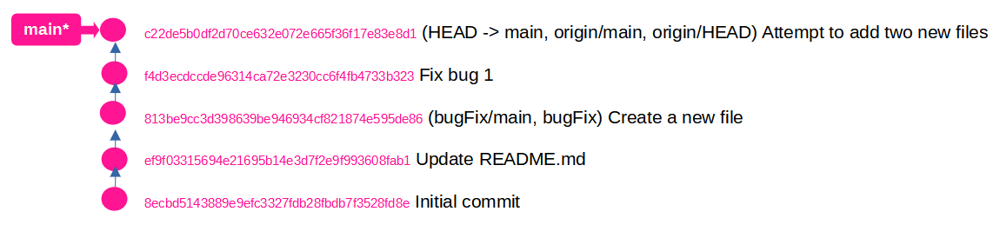

# Where's my HEAD?

The following diagram shows the git log with all the commits made so far.  Notice commits are identified with a unique sha that is highlighted in pink.  HEAD is pointing to main (HEAD → main).  The initial commit is at the bottom of the list.  The git log shows the most recent commit at the top.  The git log --pretty=oneline command was used to generate a log with one line per commit.





Use these commands to add a branch called newImage.  View git log each time to confirm where HEAD is pointing.

```
$ git branch newImage
 
$ git log --pretty=oneline
c22de5b0df2d70ce632e072e665f36f17e83e8d1 (HEAD -> main, origin/main, origin/HEAD, newImage) Attempt to add two new files
f4d3ecdccde96314ca72e3230cc6f4fb4733b323 Fix bug 1
813be9cc3d398639be946934cf821874e595de86 (bugFix/main, bugFix) Create a new file
ef9f03315694e21695b14e3d7f2e9f993608fab1 Update README.md
8ecbd5143889e9efc3327fdb28fbdb7f3528fd8e Initial commit
 
$ git commit
On branch main
Your branch is up to date with 'origin/main'.
nothing to commit, working tree clean
 
$ git log --pretty=oneline
c22de5b0df2d70ce632e072e665f36f17e83e8d1 (HEAD -> main, origin/main, origin/HEAD, newImage) Attempt to add two new files
f4d3ecdccde96314ca72e3230cc6f4fb4733b323 Fix bug 1
813be9cc3d398639be946934cf821874e595de86 (bugFix/main, bugFix) Create a new file
ef9f03315694e21695b14e3d7f2e9f993608fab1 Update README.md
8ecbd5143889e9efc3327fdb28fbdb7f3528fd8e Initial commit
 
$ git checkout newImage
Switched to branch 'newImage'
 
$ git commit
On branch newImage
nothing to commit, working tree clean
 
$ git log --pretty=oneline
c22de5b0df2d70ce632e072e665f36f17e83e8d1 (HEAD -> newImage, origin/main, origin/HEAD, main) Attempt to add two new files
f4d3ecdccde96314ca72e3230cc6f4fb4733b323 Fix bug 1
813be9cc3d398639be946934cf821874e595de86 (bugFix/main, bugFix) Create a new file
ef9f03315694e21695b14e3d7f2e9f993608fab1 Update README.md
8ecbd5143889e9efc3327fdb28fbdb7f3528fd8e Initial commit  

```
